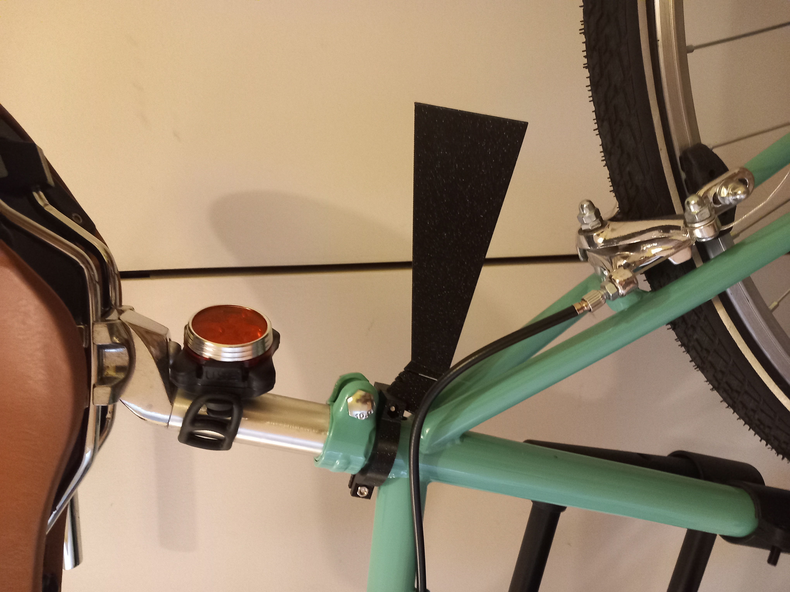
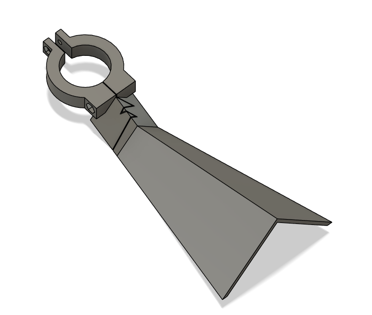
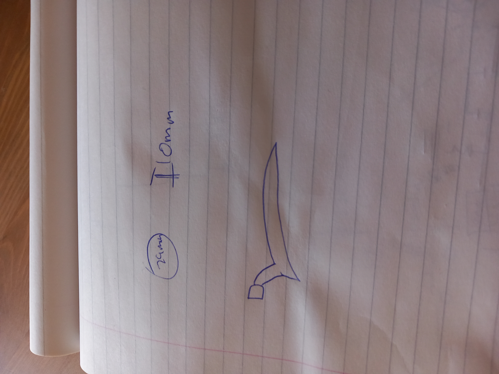
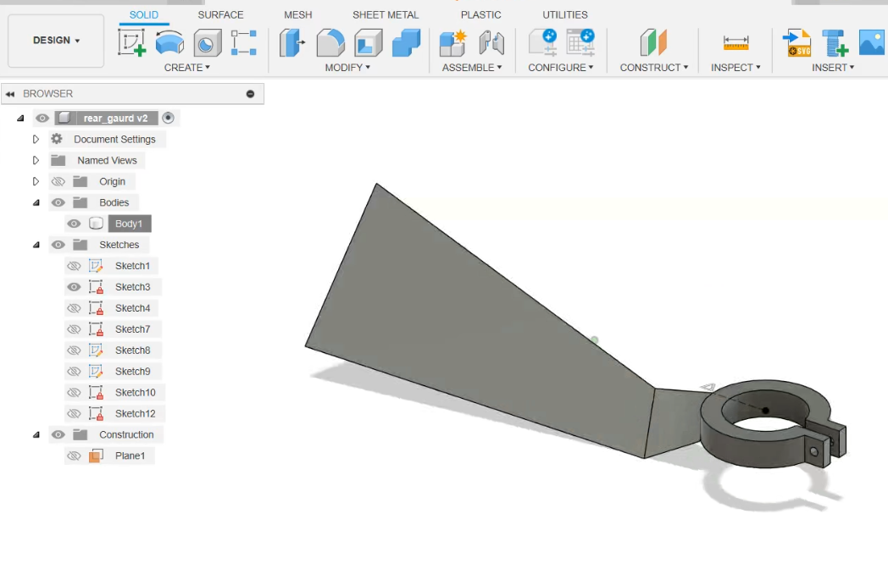
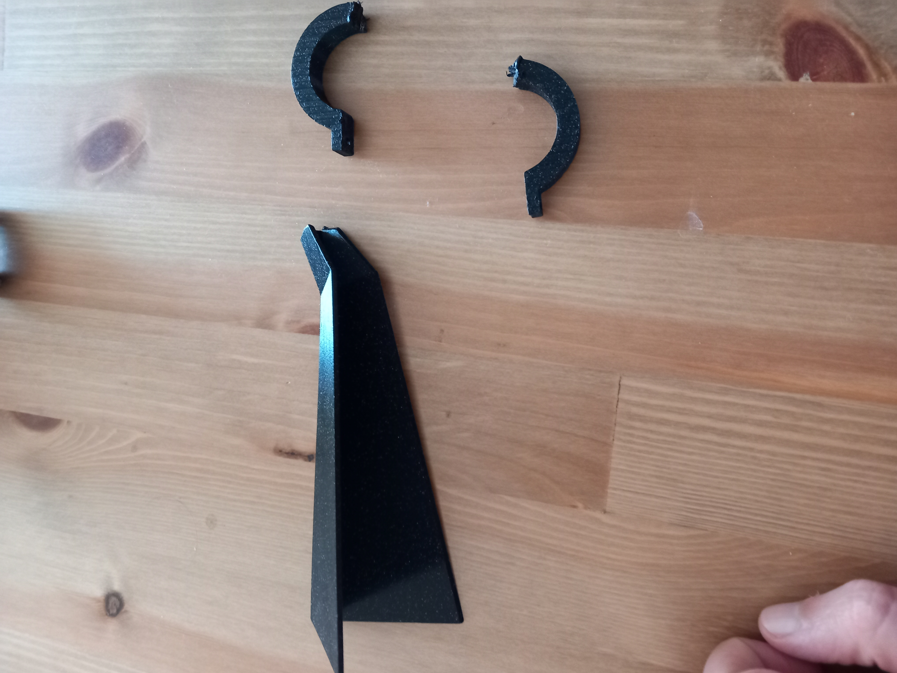

# bike_mudgaurd
files and description for a mudgaurd I built some time ago...

This is v2, and probably not the final version. It is not long enough, not very strong, and hasn't been tested in the rainy season...

  
  

The original design was below and had a major issue.  

For v1 I didn't think how I would mount to the bike, so I designed the piece (too quickly) as one big solid. After printing it i realized I couldn't force it onto the frame under the saddle because I used a brittle plastic (PLA) and couldn't force the two clamps apart enough. I forced it onto a smaller part on the frame but then couldn't get it off, and had to break it up...  
  
  